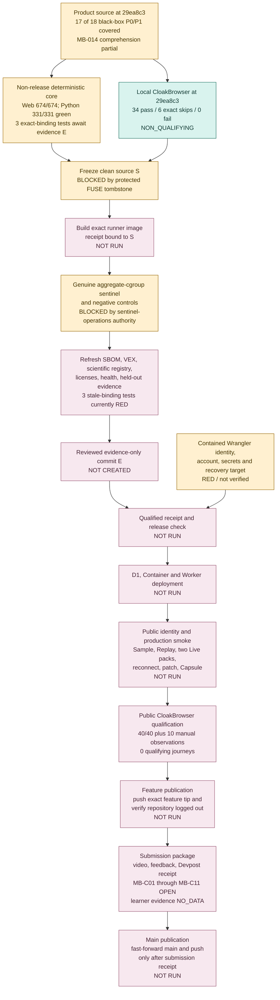
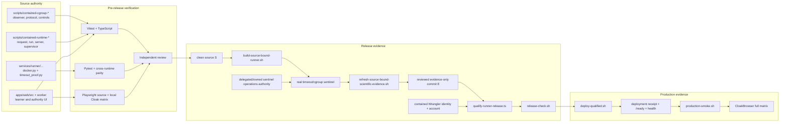
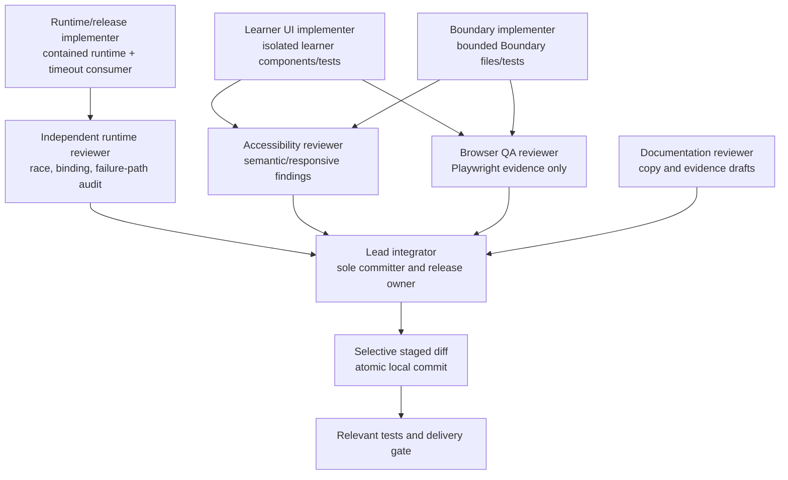
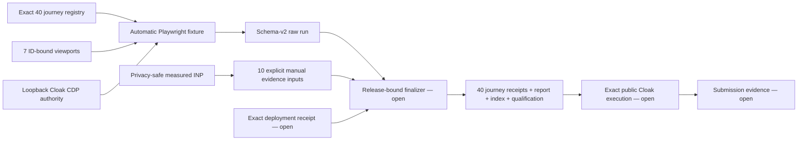
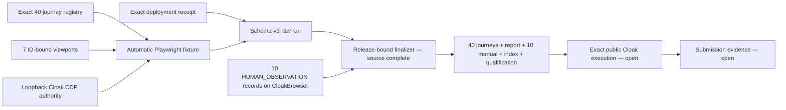

# Release dependency and review graph

- Checkpoint: `2026-07-21T13:17:03Z`
- Branch: `feat/learner-ux-v6.1`
- Committed HEAD: `6b85f2a6b713cbc4172a574a0c3be3fa075e8744`
- Deadline: `2026-07-22T00:00:00Z`
- Time remaining at this checkpoint: **10 hours 42 minutes 57 seconds**

## Purpose and evidence boundary

This document is the operational dependency graph for freezing, qualifying,
deploying, browser-testing, submitting, and merging one exact CounterLab
release. A downstream node cannot become green from source code or unit tests
alone when it requires image, cloud, browser, learner, or submission evidence.

The worktree at this checkpoint has one preserved untracked entry:
`scripts/.fuse_hidden0000a9600000801f`. It was not read, changed, hidden,
staged, or deleted for this review. Every current build, qualification,
release-check, deployment, and production-smoke script that requires a clean
worktree will reject this state.

No current deployment, public CloakBrowser qualification, learner outcome,
video, Devpost submission, branch push, or merge is claimed here.

The latest product-code commit, `29ea8c3`, passes every locally executable
CloakBrowser journey: **34 passed, 6 exact public/live skips, 0 failed**. Its
fresh replay accessibility follow-up passes **2/2** with 45 and 51 assertions.
The intervening committed changes through this checkpoint (`b78632f` and
`6b85f2a`) change documentation only; this graph refresh is also
documentation-only. This is genuine CloakBrowser source/browser evidence, but
it targets a local Worker without an exact public deployment receipt and is
therefore explicitly non-qualifying. Public qualifying execution remains **0
journeys**.

## Release dependency graph

## Current code-review slices

| Slice                                 | Commit anchors                                                                          | Source review status                     | Required downstream proof                                          |
| ------------------------------------- | --------------------------------------------------------------------------------------- | ---------------------------------------- | ------------------------------------------------------------------ |
| Recovery and intake                   | `0509833`, `51d989f`, `b9dd722`, `d6c4aec`                                              | Green                                    | Exact-public refusal and upload matrix                             |
| Prediction, transfer, and claim scope | `f12b600`, `134c22f` plus focused follow-ups                                            | Green                                    | Public transfer fail/pass and no-preseal-leak journeys             |
| Stored proof and Sample Capsule       | `7bf3c67`, `773e808`, `9441166`, `3174a1f`, `547cc0f`, `d7d23af`                        | Green                                    | Exact-deployed event, Capsule, and reconnect proof                 |
| Belief-break experience               | `7bee809`, `0a39471`, `cc61917`, `e80b390`, `830d61b`                                   | Source green; MB-014 partial             | Public first-fold and genuine cold-user comprehension evidence     |
| Runtime and release authority         | cgroup/runtime chain through `eaf4a60`, then `75dfb65`, `b37f7d9`, `84ef49d`, `7e25a09` | Source green                             | Clean source, exact image, and genuine sentinel                    |
| Submission evidence validation        | `d942c08`, `9ea8484`, `07c9091`, `8e33154`                                              | Green                                    | Real public repository, video, feedback, assets, and receipt bytes |
| Browser qualification                 | `3e75281`, `3db3e52`, `adea1c9`, `a6f6d8d`, `0ee8934`, `99e9741`                        | Harness green                            | Exact-public 40/40 plus ten manual observations                    |
| Local Cloak repairs                   | `d7d23af`, `ccb876b`, `29ea8c3`                                                         | Green locally; independent review passed | Public replay, intake, and live verification                       |

The black-box register now has **17 of 18** product P0/P1 mechanisms covered
in source. MB-014 remains partial because a cold-user 10/20/30-second
comprehension result cannot be inferred from tests. None of the 18 is
production-closed until the exact deployed tuple passes its public acceptance
journeys. Internal CL-001 submission, CL-006 learner evidence, and optional
CL-024 continuing Learning Director remain open. CL-002 containment, CL-008
read isolation, CL-009 category scope, and CL-023 cold-user visual
comprehension remain partial or mitigated rather than closed. CL-024 stays
deferred until release and submission gates are green.

## Gate ledger

| Gate                      | Required inputs                                                                                                            | Required evidence                                                                                                                                                                 | Current status                                                                                                                                                                                                                                                                          | Failure rule                                                                                                                 |
| ------------------------- | -------------------------------------------------------------------------------------------------------------------------- | --------------------------------------------------------------------------------------------------------------------------------------------------------------------------------- | --------------------------------------------------------------------------------------------------------------------------------------------------------------------------------------------------------------------------------------------------------------------------------------- | ---------------------------------------------------------------------------------------------------------------------------- |
| Source slices             | Reviewed implementation and tests                                                                                          | Atomic commits, focused tests, type checks, formatting, secret scan, whitespace check                                                                                             | At product commit `29ea8c3`, **17/18 black-box product P0/P1 mechanisms are source-covered**; MB-014 remains partial. Core deterministic and locally executable Cloak regressions are green; three release-binding tests await exact evidence.                                          | Repair in a new independent commit; do not weaken tests                                                                      |
| Review                    | Complete source slice and focused evidence                                                                                 | Independent review plus lead inspection of complete diff                                                                                                                          | Aggregate runtime review is `GO`; its initial async run/drain race and missing positive path were repaired                                                                                                                                                                              | Review findings remain open until implementation and regression tests pass                                                   |
| Clean source `S`          | Final intended source and no tracked or untracked drift                                                                    | `git status` empty and exact source commit recorded                                                                                                                               | **Blocked**: the 42-character primary root is the only runtime-capable location and remains unclean because of the preserved FUSE tombstone. Both retained linked worktrees exceed the enforced containerd shim-root maximum                                                            | Do not hide, delete, stage, or sweep the entry; no descendant worktree is a proven substitute                                |
| Exact image               | Clean `S`, source-matching contained runtime, pinned BuildKit                                                              | Build receipt v4, source/tree labels, exact runner and adapter digests                                                                                                            | **Not run** for current source; cached receipts belong to older commits                                                                                                                                                                                                                 | Never reuse or retag an earlier image as current                                                                             |
| Real sentinel             | Exact image, source-matching runtime, release-only qualification mode                                                      | Genuine memory OOM, PID denial, CPU throttling, exact membership, FINALIZE, eight cleanup facts, cgroup absence, exclusive evidence artifact                                      | **Blocked** by the repository-only rule. The observer must read delegated `/sys/fs/cgroup` controls and owned `/proc/<pid>/stat`, write its owned helper PID to delegated `cgroup.procs`, and adjust only its helper's `/proc/self/oom_score_adj`.                                      | Preserve `NO-GO`; never synthesize or inject aggregate evidence                                                              |
| Evidence refresh          | Exact image and successful real sentinel while `HEAD == S`                                                                 | Fresh normalized SBOM, VEX and negative control, scientific-engine bindings, runtime and isolation reports                                                                        | **Not run**                                                                                                                                                                                                                                                                             | Any image/source mismatch or stale binding fails closed                                                                      |
| Evidence commit `E`       | Reviewed allowlisted evidence delta                                                                                        | One clean commit containing only regenerated evidence                                                                                                                             | **Not created**                                                                                                                                                                                                                                                                         | Do not include unrelated source or cache artifacts                                                                           |
| Qualification             | Clean `HEAD == E`, build receipt, timeout receipt, source-matching runtime, authenticated Cloudflare account               | Qualified runner receipt v6 and exact registry manifest/config digest                                                                                                             | **Not run**; contained Wrangler remains logged out after two fresh OAuth callback windows expired without a returned authorization code                                                                                                                                                 | Do not promote when account, source, image, timeout, runtime, or evidence differs                                            |
| Release check             | Clean `E`, qualified receipt, exact local images and runtime                                                               | Release-check receipt v5 after formatting, tests, mutations, held-out, sandbox, scientific, build, reproduction, patch replay, and secret gates                                   | **Not run**                                                                                                                                                                                                                                                                             | Any failure blocks deployment                                                                                                |
| Cloudflare deployment     | Qualified receipt, release-check receipt, registry image, required secrets, recovery target, working CloakBrowser endpoint | Exact maintenance/final Worker versions, D1 migration log, exact Container digest, deployment receipt v7                                                                          | **Not run**                                                                                                                                                                                                                                                                             | Stop before mutation when preflight is red; after mutation, automated Worker recovery does not reverse D1 or Container state |
| Public identity and smoke | Active exact Worker/Container tuple                                                                                        | `/ready`, `/api/health?readiness=probe`, Worker 100% traffic, Container identity, public asset scan, Sample, Replay, leakage and imbalance live evidence, Capsule/replay evidence | **Not run**                                                                                                                                                                                                                                                                             | Source, image, Worker, client, receipt, or capability mismatch is a release failure                                          |
| CloakBrowser              | Exact public tuple and injected `CLOAK_CDP_ENDPOINT`                                                                       | All 40 current tests plus responsive, keyboard, screen-reader, 200% zoom, reduced-motion, console/network, downloads, reconnect, and Web Vitals evidence                          | Repository-contained CloakBrowser is operational. Latest product-code evidence at `29ea8c3` is **34 passed, 6 exact public/live skips, 0 failed**; replay accessibility is **2/2 passed**. Public qualification remains **0 journeys** until an exact deployed tuple and receipt exist. | Local or stock browser evidence cannot close the public release gate                                                         |
| Feature publication       | Exact deployed feature tip and public repository metadata                                                                  | Verified remote feature tip plus logged-out repository and setup validation                                                                                                       | **Not run**                                                                                                                                                                                                                                                                             | Do not publish a source tip that differs from the deployed tuple                                                             |
| Devpost and impact        | Qualified public tuple, public repo/video/feedback links, factual copy                                                     | Logged-out link audit, public video from exact tuple, Devpost receipt, real consented learner aggregates or explicit `NO_DATA`                                                    | **Externally unverified; learner evidence remains `NO_DATA`**                                                                                                                                                                                                                           | Never infer a submission or learner result                                                                                   |
| Main merge                | Submitted package receipt and verified feature tip                                                                         | Fast-forward-only `main` plus verified remote main tip                                                                                                                            | **Not run**                                                                                                                                                                                                                                                                             | Do not merge before submission evidence is factual                                                                           |

## Code-to-evidence graph

Source tests demonstrate behavior; they do not manufacture the observation at
the real-sentinel, Cloudflare, public-identity, or browser nodes.

## Commit and review chain at this checkpoint

The current aggregate release chain is split into independent commits:

- `0077f1a` — fixed cgroup controls;
- `fbc5ba9` — observer identity bindings;
- `37684dd` — observer protocol;
- `771d8bf` — aggregate observer;
- `317ba44` — live-session qualified-receipt binding;
- `c2c1817` — finalization signal;
- `cf90647` — fail-closed cgroup qualification;
- `bb1cc0b` — finalization-bound aggregate evidence;
- `3cdf38b` — exclusive qualification artifact-chain verification;
- `1ea2ed8` — honest pre-draft ABORT handling;
- `40db9bc` — observer/runtime qualification coordinator;
- `eaf4a60` — release-only runtime integration and control-receipt v3;
- `75dfb65` — Python v3 qualified-receipt consumption with v2 replay
  compatibility;
- `f19387b` — current live-browser selector alignment;
- `e4dc33e` — factual progress checkpoint;
- `b37f7d9` — preserves the runtime command response after the client
  half-closes its request and adds the focused regression.
- `84ef49d` — validates that the public health payload is bound to the exact
  source, Worker, client-asset, runtime, and isolation release identity.
- `547cc0f` — preserves historical integrity-hashed Proof Bundles while binding
  the complete stored bundle to its issuance event and failing closed for
  downgrades, tampering, missing keys, and rotated keys.
- `7e25a09` — requires exact release readiness before browser upload and again
  at authoritative Worker live-session admission.

Latest product-code verification at `29ea8c3` is:

- web Vitest: **80 files, 674/674 passed**;
- Python kernel, runner, and release tests: **331/331 passed**;
- leakage mutations: **14/14 detected**; imbalance mutations: **19/19
  detected**;
- held-out intake/routing: **10/10 passed**; patch-eligible completion: **7/7
  verified**; Sample Boundary: **25 cells passed**; Sample Proof Capsule:
  integrity root
  `e45cf88f1bbdd470723f83def9550d47ac272f7c5aaf8554bec52c2a34f9856b`;
- non-release scientific TypeScript: **11 files, 146/146 passed**; wider
  scientific TypeScript: **18/20 files and 239/242 tests passed**, with all
  three failures confined to stale exact-source/image registry bindings;
- local CloakBrowser: **40 tests, 34 passed, 6 exact public/live skips, 0
  failed**; fresh replay accessibility follow-up: **2/2 passed**;
- root Vitest in the restricted sandbox: **73 files, 67 passed, 6 failed; 771
  tests, 742 passed, 27 failed, 2 skipped**. Three loopback/child-process files
  then passed **49/49** with the required capability. Read-isolation was not
  rerun because its external observation is prohibited by the current
  constitution; scientific registry failures remain intentionally red until
  the exact image and evidence refresh;
- repository, web, Worker, and E2E TypeScript, full Prettier, Git whitespace,
  the 1,460-file secret scan, and the production build: **passed**;
- production output: Worker **1,868.97 kB / 360.53 kB gzip**, main client
  **449.90 kB / 129.30 kB gzip**, and CSS **201.45 kB / 34.83 kB gzip**.

These results prove the latest product code and local browser behavior. The
later committed checkpoint changes through `6b85f2a` and this graph refresh
are documentation-only. The results do not manufacture a clean source, exact
image, real aggregate containment observation, Cloudflare qualification,
deployment, or public browser receipt; every downstream release node remains
open.

## File ownership and reviewer graph

| Area                                                        | Writable owner                                          | Required reviewer/evidence                                          | Integration owner |
| ----------------------------------------------------------- | ------------------------------------------------------- | ------------------------------------------------------------------- | ----------------- |
| `apps/web/src/App.tsx`, global routes/state/CSS             | Lead only                                               | React/Vitest, accessibility and browser review                      | Lead              |
| `apps/web/src/components/learner/`, `features/learner/`     | Assigned learner implementer when isolated              | Focused component tests, accessibility review, lead diff review     | Lead              |
| Boundary Hunt files                                         | Assigned Boundary implementer                           | Boundary invariants, keyboard/table/non-colour review               | Lead              |
| `scripts/contained-*`, release receipts and release scripts | Lead or one explicitly assigned runtime owner at a time | Runtime Vitest, Python parity, independent review, lead diff review | Lead              |
| `services/runner/.../docker.py` and `timeout_proof.py`      | One runtime owner at a time                             | Runner Pytest, cross-language receipt parity, failure-path review   | Lead              |
| Worker/API/contracts/session transitions                    | Lead only                                               | TypeScript, Worker tests, authority-boundary review                 | Lead              |
| Scientific/SBOM tracked evidence                            | Lead during exact refresh                               | Hash/schema verification and evidence-only diff review              | Lead              |
| Playwright specifications and evidence                      | Browser QA owner on assigned files                      | CloakBrowser execution, console/network and accessibility evidence  | Lead              |
| Root release/submission documentation                       | Lead integrates reviewer drafts                         | Claim-to-evidence review                                            | Lead              |
| Git commits, push, deployment and merge                     | Lead only                                               | Clean staged diff and final delivery gate                           | Lead              |

No two writers may own the same shared file or receipt registry concurrently.
Only the lead stages, commits, deploys, pushes, or fast-forwards `main`.

## Disciplines and skills applied

The owner requested the listed engineering disciplines. At this checkpoint the
repository constitution prohibits reading external skill files, so the lead
applied the same disciplines directly from checked-in instructions and current
repository evidence. The constitution remains the governing product and
filesystem authority.

| Discipline                  | Direct application in this graph                                                                                                                                                                                                                                             |
| --------------------------- | ---------------------------------------------------------------------------------------------------------------------------------------------------------------------------------------------------------------------------------------------------------------------------- |
| Repository safety           | All repository work and generated state stay inside the verified root; the FUSE entry is preserved; no destructive cleanup, stash, reset, or outside-root filesystem operation is accepted.                                                                                  |
| Code review                 | Each logical slice has focused characterization/regression tests, an isolated diff, independent review where assigned, and lead integration before an atomic commit.                                                                                                         |
| Accessibility               | Browser closure requires semantic names, keyboard completion, visible focus, exact-value tables, non-colour meaning, reduced motion, zoom, responsive viewports, touch targets, and screen-reader inspection.                                                                |
| React testing               | Component and App behavior is checked with Vitest and strict TypeScript; Playwright covers composed learner journeys, authority labels, refresh, navigation, downloads, and no-result-before-Prediction behavior.                                                            |
| Playwright and CloakBrowser | Static collection is not browser evidence; release qualification requires the injected CloakBrowser CDP authority, accessibility snapshots, screenshots where visual judgment matters, and console/network review. Stock Chromium cannot close the gate.                     |
| Cloudflare and Wrangler     | The repository-pinned Wrangler, contained account identity, exact registry digest, maintenance freeze, remote D1 migration, Container rollout, final Worker, recovery target, and public identity receipt form one ordered gate.                                             |
| Delivery gate               | Clean `S` -> exact image -> real sentinel -> evidence `E` -> qualification -> release check -> deployment -> public smoke -> full browser matrix -> feature push/repo verification -> submission -> fast-forward main. No later node may compensate for an earlier red node. |
| Diagnosing bugs             | Required the red command-server characterization before the one-line half-close repair, followed by focused and original-path runtime proof.                                                                                                                                 |
| Git workflow                | Requires selective staging, staged-diff review, configured owner identity, independent logical commits, and no merge or publication before their factual gates.                                                                                                              |
| Build graph                 | The last full structural graph remains the `b37f7d9` snapshot at 531 files, 5,515 nodes, and 93,346 edges. The operational release graph is current at `6b85f2a`; structural counts are not relabelled without rerunning their generator.                                    |
| Code review                 | Runs standards and specification reviews as separate read-only axes against `main`; findings do not become closed until accepted tests and public evidence pass.                                                                                                             |
| Browser QA and Playwright   | Keeps local CloakBrowser evidence explicitly non-qualifying and requires exact-public CloakBrowser authority, semantic snapshots, screenshots, console/network inspection, accessibility, and responsive evidence.                                                           |
| Wrangler                    | Requires current documentation, repository-contained CLI state, authenticated-account proof, dry-run/preflight, exact version/digest capture, and qualified-only deployment.                                                                                                 |

## Current blockers and shortest honest path

1. The source-level aggregate runtime chain is implemented and reviewed, but a
   real delegated-cgroup sentinel has not run.
2. The current constitution prohibits the sentinel's necessary delegated
   `/sys/fs/cgroup` control reads, owned `/proc/<pid>/stat` reads, owned-helper
   membership write to delegated `cgroup.procs`, and helper-local
   `/proc/self/oom_score_adj` write. Read-only permission is insufficient. The
   release must remain `NO-GO` unless the checked-in authority explicitly
   permits these narrow agent-owned/delegated operations or another
   constitution-compatible evidence path is established.
3. Both retained linked-worktree candidates were attempted and disproved as
   runtime release roots: their physical paths exceed the 42-character
   containerd shim limit. The primary physical root is exactly 42 characters
   and successfully hosts `rt-mainrel04`, but its preserved FUSE tombstone
   prevents a clean frozen source.
4. No current-source image, scientific-evidence refresh, evidence commit,
   qualified receipt, or release-check receipt exists.
5. Contained Wrangler authentication is explicitly red: the current
   repository-contained `wrangler whoami --json` returned
   `{"loggedIn":false}`, and two fresh OAuth callback windows expired without
   a returned authorization code. The intended Cloudflare account has not been
   authenticated inside the contained environment for this release.
6. CloakBrowser is operational and the local latest-product-code matrix at
   `29ea8c3` is green.
   `deploy-qualified.sh` performs remote Worker, D1, and Container mutations
   before invoking the smoke script, so the exact public origin and deployment
   receipt must still be supplied to the qualifying run. Local browser
   evidence cannot close that public gate.
7. Commit `0ee8934` closes the checked-in browser finalizer source path: seven
   ID-bound viewports, privacy-safe INP, schema-v3 raw evidence, deterministic
   40-journey receipts, ten honestly labelled human-observation receipts, and
   cross-bound report/index/qualification evidence. Exact public CloakBrowser
   execution and manual observation remain open at **0 qualifying journeys**.
8. Learner evidence remains `NO_DATA`; public repository, video, feedback ID,
   Devpost publication, and submission receipt remain externally unverified.

The shortest honest path is to resolve the clean-source condition at the primary
physical root without hiding or deleting the protected tombstone; obtain narrow
authority for the sentinel's delegated/owned cgroup and process operations;
freeze `S`; build one exact image; run the genuine sentinel; refresh and commit
evidence as `E`; authenticate contained Wrangler; qualify and release-check;
preflight CloakBrowser; deploy once; verify the exact public tuple and browser
matrix; push and verify the exact feature tip; finalize the factual submission;
then fast-forward and push `main`.

## Final release review questions

- Does every result-bearing claim name its exact signed or integrity-hashed
  source?
- Are Sample, Replay, and Live labels persistent and non-interchangeable?
- Is `S` the exact runner source and an ancestor of evidence commit `E`?
- Do the image, aggregate evidence, qualification, release-check, deployment,
  Worker, client, and public-health hashes agree?
- Did a real observer produce the aggregate evidence, with no caller-supplied
  substitute?
- Did all deterministic gates pass without weakening or skipping a test?
- Did the exact public tuple complete both untouched supported live flows?
- Did CloakBrowser execute the full responsive, accessibility, failure,
  reconnect, download, console/network, and performance matrix?
- Is learner impact either backed by consented rows or still explicitly
  `NO_DATA`?
- Do the app, repository, video, screenshots, feedback ID, Devpost copy, and
  submission receipt describe the same exact release?
- Was the exact feature branch pushed and verified logged out before
  submission, and was `main` fast-forwarded only after the receipt existed?

Any `no`, unknown, or unavailable answer keeps the corresponding gate open.

## Historical browser evidence graph — `a6f6d8d` (superseded)

This historical checkpoint is superseded by the source-complete `0ee8934`
finalizer below. At `a6f6d8d`, committed source failed closed on stock authority, non-loopback CDP,
wrong public origin, ID or viewport drift, retries/skips, fixture-only
assertions, telemetry mismatch, reversed chronology, unexpected browser
failures, symlink traversal, and evidence overwrite. This closes the browser
instrumentation source gaps identified at `7e25a09`; it does **not** close the
finalizer, live Cloak execution, exact release, deployment, or submission
nodes. Current qualifying journey count remains **0**.

## Browser evidence graph addendum — `0ee8934`

The finalizer is byte- and release-bound, stages only in ignored
repository-local state, uses an exclusive receipt-hash reservation, refuses
replacement, and publishes only after every staged hash passes. Independent
review passed its concurrent-publication probe and all focused gates. Manual
checks are labelled human observations; their integrity receipts do not claim
automated accessibility judgment. Current public qualification remains **0
journeys**, so no production, accessibility, performance, or comprehension
result is closed by this source commit alone.
