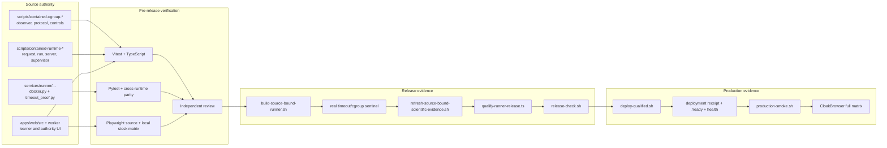
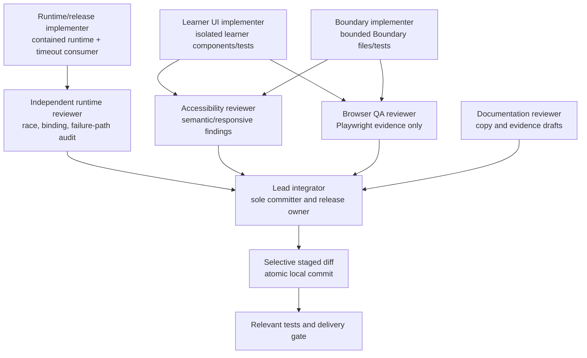
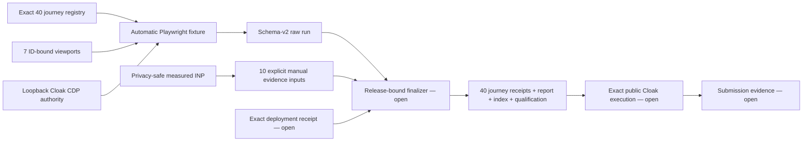

# Release dependency and review graph

- Checkpoint: `2026-07-21T09:06:33Z`
- Branch: `feat/learner-ux-v6.1`
- Committed HEAD: `7e25a098b74d18b30d84a1bc80938ef1d94e95e9`
- Deadline: `2026-07-22T00:00:00Z`
- Time remaining at this checkpoint: **14 hours 53 minutes 27 seconds**

## Purpose and evidence boundary

This document is the operational dependency graph for freezing, qualifying,
deploying, browser-testing, submitting, and merging one exact CounterLab
release. A downstream node cannot become green from source code or unit tests
alone when it requires image, cloud, browser, learner, or submission evidence.

The worktree at this checkpoint has one preserved untracked entry:
`scripts/.fuse_hidden0000a9600000801f`. It was not read, changed, hidden,
staged, or deleted for this review. Every current build, qualification,
release-check, deployment, and production-smoke script that requires a clean
worktree will reject this state.

No current deployment, rendered CloakBrowser journey, learner outcome, video,
Devpost submission, branch push, or merge is claimed here.

The complete local `stock-chromium-design-review` matrix now passes every
locally executable journey on a fresh repository-contained state: **35 passed,
5 intentionally skipped, 0 failed in 3.9 minutes**. The five skips are the two exact-public mobile replay journeys,
one exact-public asset scan, and two qualified hosted-runner journeys. This is
useful source/design evidence; it is not public or CloakBrowser qualification.

## Release dependency graph

```mermaid
flowchart TD
  A["Source slices<br/>atomic commits + focused tests<br/>SOURCE COMPLETE for reviewed P0 repairs"]
  B["Review gate<br/>independent review + lead diff review<br/>PASS for reviewed P0 repairs"]
  R["Contained runtime command channel<br/>rt-mainrel04 READY / VERIFIED<br/>PASS"]
  P["Historical Proof Bundle validation<br/>issuance-event anchored<br/>PASS"]
  V["Exact live-session admission<br/>browser advisory + Worker authoritative gate<br/>PASS"]
  C["Clean source freeze S<br/>primary root blocked by FUSE tombstone;<br/>linked roots exceed runtime maximum"]
  D["Exact runner and adapter image<br/>build receipt v4 bound to S<br/>NOT RUN for current source"]
  E["Real aggregate timeout sentinel<br/>observer + controls + FINALIZE + cleanup<br/>BLOCKED by /sys and /proc authority"]
  F["Source/image evidence refresh<br/>SBOM + VEX + engine evidence<br/>NOT RUN"]
  G["Evidence commit E<br/>reviewed allowlisted evidence only<br/>NOT CREATED"]
  H["Qualification<br/>receipt v6 + immutable registry image<br/>NOT RUN; Wrangler identity unverified"]
  I["Release check<br/>receipt v5 + deterministic full gate<br/>NOT RUN"]
  J["Cloudflare deployment<br/>maintenance + D1 + Container + Worker<br/>NOT RUN"]
  K["Public identity and smoke<br/>deployment receipt v7 + /ready + health + live loops<br/>NOT RUN"]
  L["Browser qualification<br/>launcher registered; current session lacks tools<br/>public CloakBrowser: 0 journeys"]
  M["Submission package<br/>public app + repo + video + feedback + honest NO_DATA<br/>EXTERNALLY UNVERIFIED"]
  N["Git publication<br/>push feature -> verify remote -> fast-forward main -> push main<br/>NOT RUN"]

  A --> B --> R --> P --> V --> C --> D --> E --> F --> G --> H --> I --> J --> K --> L --> M --> N

  classDef pass fill:#d9f3ee,stroke:#176b5b,color:#123b34;
  classDef blocked fill:#fff0d0,stroke:#9a6500,color:#4c3500;
  classDef pending fill:#eef2f7,stroke:#596579,color:#252b36;
  classDef external fill:#f7e8ef,stroke:#95506d,color:#482636;
  class A,B,R,P,V pass;
  class C,E blocked;
  class D,F,G,H,I,J,K,L pending;
  class M,N external;
```

## Gate ledger

| Gate                      | Required inputs                                                                                                            | Required evidence                                                                                                                                                                 | Current status                                                                                                                                                                                                                                                                   | Failure rule                                                                                                                 |
| ------------------------- | -------------------------------------------------------------------------------------------------------------------------- | --------------------------------------------------------------------------------------------------------------------------------------------------------------------------------- | -------------------------------------------------------------------------------------------------------------------------------------------------------------------------------------------------------------------------------------------------------------------------------- | ---------------------------------------------------------------------------------------------------------------------------- |
| Source slices             | Reviewed implementation and tests                                                                                          | Atomic commits, focused tests, type checks, formatting, secret scan, whitespace check                                                                                             | Aggregate observer/runtime/consumer chain, release-health validation, historical Proof Bundle validation, and exact live-session admission are source-complete                                                                                                                   | Repair in a new independent commit; do not weaken tests                                                                      |
| Review                    | Complete source slice and focused evidence                                                                                 | Independent review plus lead inspection of complete diff                                                                                                                          | Aggregate runtime review is `GO`; its initial async run/drain race and missing positive path were repaired                                                                                                                                                                       | Review findings remain open until implementation and regression tests pass                                                   |
| Clean source `S`          | Final intended source and no tracked or untracked drift                                                                    | `git status` empty and exact source commit recorded                                                                                                                               | **Blocked**: the 42-character primary root is the only runtime-capable location and remains unclean because of the preserved FUSE tombstone. Both retained linked worktrees exceed the enforced containerd shim-root maximum                                                     | Do not hide, delete, stage, or sweep the entry; no descendant worktree is a proven substitute                                |
| Exact image               | Clean `S`, source-matching contained runtime, pinned BuildKit                                                              | Build receipt v4, source/tree labels, exact runner and adapter digests                                                                                                            | **Not run** for current source; cached receipts belong to older commits                                                                                                                                                                                                          | Never reuse or retag an earlier image as current                                                                             |
| Real sentinel             | Exact image, source-matching runtime, release-only qualification mode                                                      | Genuine memory OOM, PID denial, CPU throttling, exact membership, FINALIZE, eight cleanup facts, cgroup absence, exclusive evidence artifact                                      | **Blocked** by the checked-in repository-only filesystem rule, which does not permit required `/sys/fs/cgroup` and owned `/proc/<pid>/stat` reads                                                                                                                                | Preserve `NO-GO`; never synthesize or inject aggregate evidence                                                              |
| Evidence refresh          | Exact image and successful real sentinel while `HEAD == S`                                                                 | Fresh normalized SBOM, VEX and negative control, scientific-engine bindings, runtime and isolation reports                                                                        | **Not run**                                                                                                                                                                                                                                                                      | Any image/source mismatch or stale binding fails closed                                                                      |
| Evidence commit `E`       | Reviewed allowlisted evidence delta                                                                                        | One clean commit containing only regenerated evidence                                                                                                                             | **Not created**                                                                                                                                                                                                                                                                  | Do not include unrelated source or cache artifacts                                                                           |
| Qualification             | Clean `HEAD == E`, build receipt, timeout receipt, source-matching runtime, authenticated Cloudflare account               | Qualified runner receipt v6 and exact registry manifest/config digest                                                                                                             | **Not run**; contained Wrangler is logged out and one fresh OAuth window timed out without consent                                                                                                                                                                               | Do not promote when account, source, image, timeout, runtime, or evidence differs                                            |
| Release check             | Clean `E`, qualified receipt, exact local images and runtime                                                               | Release-check receipt v5 after formatting, tests, mutations, held-out, sandbox, scientific, build, reproduction, patch replay, and secret gates                                   | **Not run**                                                                                                                                                                                                                                                                      | Any failure blocks deployment                                                                                                |
| Cloudflare deployment     | Qualified receipt, release-check receipt, registry image, required secrets, recovery target, working CloakBrowser endpoint | Exact maintenance/final Worker versions, D1 migration log, exact Container digest, deployment receipt v7                                                                          | **Not run**                                                                                                                                                                                                                                                                      | Stop before mutation when preflight is red; after mutation, automated Worker recovery does not reverse D1 or Container state |
| Public identity and smoke | Active exact Worker/Container tuple                                                                                        | `/ready`, `/api/health?readiness=probe`, Worker 100% traffic, Container identity, public asset scan, Sample, Replay, leakage and imbalance live evidence, Capsule/replay evidence | **Not run**                                                                                                                                                                                                                                                                      | Source, image, Worker, client, receipt, or capability mismatch is a release failure                                          |
| CloakBrowser              | Exact public tuple and injected `CLOAK_CDP_ENDPOINT`                                                                       | All 40 current tests plus responsive, keyboard, screen-reader, 200% zoom, reduced-motion, console/network, downloads, reconnect, and Web Vitals evidence                          | `playwright_safe` is registered and enabled, but this active session has no loaded tool namespace or endpoint. Public CloakBrowser remains **0 journeys**. Current specs also lack three required viewport labels, INP collection, and the deterministic qualification reporter. | Stock Chromium is design-review evidence only and cannot close this gate                                                     |
| Devpost and impact        | Qualified public tuple, public repo/video/feedback links, factual copy                                                     | Logged-out link audit, public video from exact tuple, Devpost receipt, real consented learner aggregates or explicit `NO_DATA`                                                    | **Externally unverified; learner evidence remains `NO_DATA`**                                                                                                                                                                                                                    | Never infer a submission or learner result                                                                                   |
| Push and merge            | Every ship gate factual and final source reviewed                                                                          | Verified feature remote tip, fast-forward-only `main`, verified main remote tip                                                                                                   | **Not run**                                                                                                                                                                                                                                                                      | Do not push or merge a `NO-GO` release                                                                                       |

## Code-to-evidence graph

Source tests demonstrate behavior; they do not manufacture the observation at
the real-sentinel, Cloudflare, public-identity, or browser nodes.

## Commit and review chain at this checkpoint

The current aggregate release chain is split into independent commits:

- `0077f1a` — fixed cgroup controls;
- `fbc5ba9` — observer identity bindings;
- `37684dd` — observer protocol;
- `771d8bf` — aggregate observer;
- `317ba44` — live-session qualified-receipt binding;
- `c2c1817` — finalization signal;
- `cf90647` — fail-closed cgroup qualification;
- `bb1cc0b` — finalization-bound aggregate evidence;
- `3cdf38b` — exclusive qualification artifact-chain verification;
- `1ea2ed8` — honest pre-draft ABORT handling;
- `40db9bc` — observer/runtime qualification coordinator;
- `eaf4a60` — release-only runtime integration and control-receipt v3;
- `75dfb65` — Python v3 qualified-receipt consumption with v2 replay
  compatibility;
- `f19387b` — current live-browser selector alignment;
- `e4dc33e` — factual progress checkpoint;
- `b37f7d9` — preserves the runtime command response after the client
  half-closes its request and adds the focused regression.
- `84ef49d` — validates that the public health payload is bound to the exact
  source, Worker, client-asset, runtime, and isolation release identity.
- `547cc0f` — preserves historical integrity-hashed Proof Bundles while binding
  the complete stored bundle to its issuance event and failing closed for
  downgrades, tampering, missing keys, and rotated keys.
- `7e25a09` — requires exact release readiness before browser upload and again
  at authoritative Worker live-session admission.

Reported verification for the integrated aggregate slice is:

- runtime/request/observer/coordinator/receipt Vitest: **7 files, 68/68
  passed**;
- complete runner Pytest with both required source roots: **82/82 passed**;
- repository, web client, generated Worker, and Worker TypeScript: **passed**;
- E2E strict TypeScript: **passed**;
- Complete local stock-browser matrix: **40 tests in 3 files**, **35 passed,
  5 intentionally skipped, 0 failed in 3.9 minutes** on fresh current-source
  local state. The public replay,
  public asset, and real hosted-runner cases remain deferred to the exact
  release tuple;
- current web Vitest: **79 files, 626/626 passed**; current capability-enabled
  root Vitest: **750 passed, 3 stale-evidence failures, 2 skipped**;
- current Python behavior: **330/331** in the restricted run plus the sole
  loopback-only service test **1/1** with socket permission;
- critical mutations: leakage **14/14** and imbalance **19/19 detected**;
- scoped Prettier, Python compilation, Node syntax, Git whitespace, and secret
  scans: **passed**;
- current contained-runtime command-channel suite: **7 files, 65/65 passed**;
- historical proof validation: Worker API **106/106 passed** and Proof Bundle
  package **12/12 passed**;
- exact live admission: App **74/74 passed**, Worker API **107/107 passed**, and
  API/Judge **50/50 passed**;
- repository-contained pnpm 11.13.1 production build: **passed** with 391 Worker
  and 231 client modules; Worker **1,868.90 kB / 360.50 kB gzip** and main
  client **449.75 kB / 129.26 kB gzip**;
- current Node syntax, scoped Prettier, repository TypeScript, two-file secret
  scan, and Git whitespace: **passed**;
- fresh primary runtime `rt-mainrel04`: schema-v2 response status **VERIFIED**;
  session attestation **READY**; live BuildKit client **v0.30.0**, containerd
  **v2.3.1**, and runc **1.4.2** version response confirmed;
- independent runtime integration review: **GO** after the implementation
  repaired its initial async run/drain race and missing positive
  qualification-path coverage.

The broad web/root/Python/browser matrix predates `7e25a09` and must be
rerun on the final frozen source. The current focused results are source and
runtime command-channel evidence only. They are not exact-image, aggregate
containment, qualification, or deployment evidence; every downstream release
node remains open.

## File ownership and reviewer graph

| Area                                                        | Writable owner                                          | Required reviewer/evidence                                          | Integration owner |
| ----------------------------------------------------------- | ------------------------------------------------------- | ------------------------------------------------------------------- | ----------------- |
| `apps/web/src/App.tsx`, global routes/state/CSS             | Lead only                                               | React/Vitest, accessibility and browser review                      | Lead              |
| `apps/web/src/components/learner/`, `features/learner/`     | Assigned learner implementer when isolated              | Focused component tests, accessibility review, lead diff review     | Lead              |
| Boundary Hunt files                                         | Assigned Boundary implementer                           | Boundary invariants, keyboard/table/non-colour review               | Lead              |
| `scripts/contained-*`, release receipts and release scripts | Lead or one explicitly assigned runtime owner at a time | Runtime Vitest, Python parity, independent review, lead diff review | Lead              |
| `services/runner/.../docker.py` and `timeout_proof.py`      | One runtime owner at a time                             | Runner Pytest, cross-language receipt parity, failure-path review   | Lead              |
| Worker/API/contracts/session transitions                    | Lead only                                               | TypeScript, Worker tests, authority-boundary review                 | Lead              |
| Scientific/SBOM tracked evidence                            | Lead during exact refresh                               | Hash/schema verification and evidence-only diff review              | Lead              |
| Playwright specifications and evidence                      | Browser QA owner on assigned files                      | CloakBrowser execution, console/network and accessibility evidence  | Lead              |
| Root release/submission documentation                       | Lead integrates reviewer drafts                         | Claim-to-evidence review                                            | Lead              |
| Git commits, push, deployment and merge                     | Lead only                                               | Clean staged diff and final delivery gate                           | Lead              |

No two writers may own the same shared file or receipt registry concurrently.
Only the lead stages, commits, deploys, pushes, or fast-forwards `main`.

## Disciplines and skills applied

The owner explicitly authorized the installed skill instructions for this pass.
The lead read and applied the following skills while preserving the checked-in
repository constitution as the governing product and filesystem authority.

| Discipline                  | Direct application in this graph                                                                                                                                                                                                                                                  |
| --------------------------- | --------------------------------------------------------------------------------------------------------------------------------------------------------------------------------------------------------------------------------------------------------------------------------- |
| Repository safety           | All repository work and generated state stay inside the verified root; the FUSE entry is preserved; no destructive cleanup, stash, reset, or outside-root filesystem operation is accepted.                                                                                       |
| Code review                 | Each logical slice has focused characterization/regression tests, an isolated diff, independent review where assigned, and lead integration before an atomic commit.                                                                                                              |
| Accessibility               | Browser closure requires semantic names, keyboard completion, visible focus, exact-value tables, non-colour meaning, reduced motion, zoom, responsive viewports, touch targets, and screen-reader inspection.                                                                     |
| React testing               | Component and App behavior is checked with Vitest and strict TypeScript; Playwright covers composed learner journeys, authority labels, refresh, navigation, downloads, and no-result-before-Prediction behavior.                                                                 |
| Playwright and CloakBrowser | Static collection is not browser evidence; release qualification requires the injected CloakBrowser CDP authority, accessibility snapshots, screenshots where visual judgment matters, and console/network review. Stock Chromium cannot close the gate.                          |
| Cloudflare and Wrangler     | The repository-pinned Wrangler, contained account identity, exact registry digest, maintenance freeze, remote D1 migration, Container rollout, final Worker, recovery target, and public identity receipt form one ordered gate.                                                  |
| Delivery gate               | Clean `S` -> exact image -> real sentinel -> evidence `E` -> qualification -> release check -> deployment -> public smoke -> full browser matrix -> submission -> push/fast-forward merge. No later node may compensate for an earlier red node.                                  |
| Diagnosing bugs             | Required the red command-server characterization before the one-line half-close repair, followed by focused and original-path runtime proof.                                                                                                                                      |
| Git workflow                | Required selective staging, non-executable test mode, staged-diff review, configured owner identity, and the independent `b37f7d9` commit.                                                                                                                                        |
| Build graph                 | The last full structural graph remains the `b37f7d9` snapshot at 531 files, 5,515 nodes, and 93,346 edges. The operational release graph and current 140-file branch delta are updated here at `7e25a09`; structural counts are not relabelled without rerunning their generator. |
| Code review                 | Runs standards and specification reviews as separate read-only axes against `main`; findings do not become closed until accepted tests and public evidence pass.                                                                                                                  |
| Browser QA and Playwright   | Keeps the stock matrix explicitly non-qualifying and requires the registered CloakBrowser authority, semantic snapshots, screenshots, console/network inspection, accessibility, and responsive evidence.                                                                         |
| Wrangler                    | Requires current documentation, repository-contained CLI state, authenticated-account proof, dry-run/preflight, exact version/digest capture, and qualified-only deployment.                                                                                                      |

## Current blockers and shortest honest path

1. The source-level aggregate runtime chain is implemented and reviewed, but a
   real delegated-cgroup sentinel has not run.
2. The current constitution prohibits the sentinel's necessary `/sys/fs/cgroup`
   and owned `/proc/<pid>/stat` reads. The release must remain `NO-GO` unless the
   checked-in authority changes or another constitution-compatible evidence
   path is established.
3. Both retained linked-worktree candidates were attempted and disproved as
   runtime release roots: their physical paths exceed the 42-character
   containerd shim limit. The primary physical root is exactly 42 characters
   and successfully hosts `rt-mainrel04`, but its preserved FUSE tombstone
   prevents a clean frozen source.
4. No current-source image, scientific-evidence refresh, evidence commit,
   qualified receipt, or release-check receipt exists.
5. Contained Wrangler authentication is explicitly red: a fresh
   `wrangler whoami --json` at `7e25a09` returned `{"loggedIn":false}`. The
   intended Cloudflare account has not been authenticated inside the
   repository-contained environment for this release.
6. The Cloak launcher registration is enabled, but the current Codex session
   predates it and exposes no `playwright_safe` tools or `CLOAK_CDP_ENDPOINT`.
   A fresh session is required. `deploy-qualified.sh` performs remote Worker,
   D1, and Container mutations before invoking the smoke script, while
   `production-smoke.sh` requires CloakBrowser. CloakBrowser must therefore be
   preflighted before deployment starts.
7. The checked-in browser evidence path still needs the remaining three
   required viewport labels, INP capture, and deterministic 40-journey/manual
   evidence receipts before it can satisfy the publication schema.
8. Learner evidence remains `NO_DATA`; public repository, video, feedback ID,
   Devpost publication, and submission receipt remain externally unverified.

The shortest honest path is to resolve the clean-source condition at the primary
physical root without hiding or deleting the protected tombstone; obtain narrow
read-only cgroup-observation authority; freeze `S`; build one exact image; run
the genuine sentinel; refresh and commit evidence as `E`; authenticate contained
Wrangler; qualify and release-check; preflight CloakBrowser; deploy once; verify
the exact public tuple and browser matrix; finalize the factual submission; then
push and fast-forward merge.

## Final release review questions

- Does every result-bearing claim name its exact signed or integrity-hashed
  source?
- Are Sample, Replay, and Live labels persistent and non-interchangeable?
- Is `S` the exact runner source and an ancestor of evidence commit `E`?
- Do the image, aggregate evidence, qualification, release-check, deployment,
  Worker, client, and public-health hashes agree?
- Did a real observer produce the aggregate evidence, with no caller-supplied
  substitute?
- Did all deterministic gates pass without weakening or skipping a test?
- Did the exact public tuple complete both untouched supported live flows?
- Did CloakBrowser execute the full responsive, accessibility, failure,
  reconnect, download, console/network, and performance matrix?
- Is learner impact either backed by consented rows or still explicitly
  `NO_DATA`?
- Do the app, repository, video, screenshots, feedback ID, Devpost copy, and
  submission receipt describe the same exact release?
- Was the feature branch pushed and verified before a fast-forward-only merge
  to `main`?

Any `no`, unknown, or unavailable answer keeps the corresponding gate open.

## Browser evidence graph addendum — `a6f6d8d`

Committed source now fails closed on stock authority, non-loopback CDP,
wrong public origin, ID or viewport drift, retries/skips, fixture-only
assertions, telemetry mismatch, reversed chronology, unexpected browser
failures, symlink traversal, and evidence overwrite. This closes the browser
instrumentation source gaps identified at `7e25a09`; it does **not** close the
finalizer, live Cloak execution, exact release, deployment, or submission
nodes. Current qualifying journey count remains **0**.
